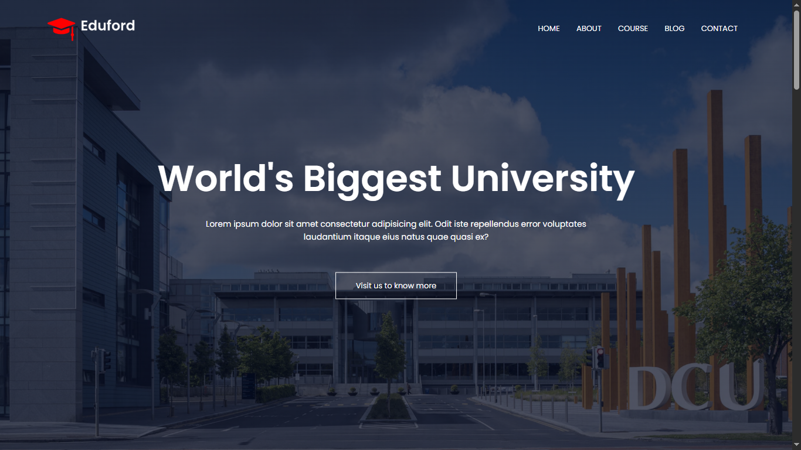
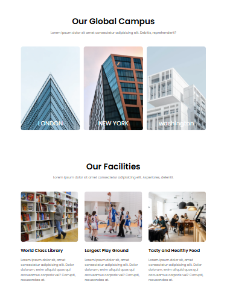

# 📚 EduMaster - University Promo Website

Welcome to the **EduMaster** – a fully responsive, elegant, and informative website built with pure **HTML5** and **CSS3**, designed to showcase a university's mission, programs, faculty, and facilities in a compelling way.



## 🌟 Overview

This project represents a modern, accessible website for promoting a university or educational institution. It's perfect for demonstrating front-end development skills while delivering a clean user experience focused on education, trust, and professionalism.

## 🚀 Key Features

- 🏛️ Home page with university introduction
- 📚 Programs & Courses page
- 🧑‍🏫 Faculty and staff highlights
- 🏫 Campus life and facilities section
- 📞 Contact page with a functional layout
- 💼 About page showcasing university history and values
- 📱 Fully responsive for mobile, tablet, and desktop
- 🎨 Stylish layout using only HTML and CSS (no JS or frameworks)

## 📁 Live Demo

👉 [View the Live Site](https://iamchiranjeevir.github.io/Eduford/)

## 🛠️ Tech Stack

- **HTML5** – Semantic and accessible markup
- **CSS3** – Custom design with responsive layout and styling

## 🖼️ Screenshots



## 📦 How to Use

1. Clone the repository:
   ```bash
   git clone https://iamchiranjeevir.github.io/Eduford/.git
   cd Eduford

## 📫 Contact

Got feedback or suggestions? Reach out to me:

- GitHub: [@iamchiranjeevir](https://github.com/iamchiranjeevir)
- Email: iamchiranjeeviramakrishna@gmail.com

